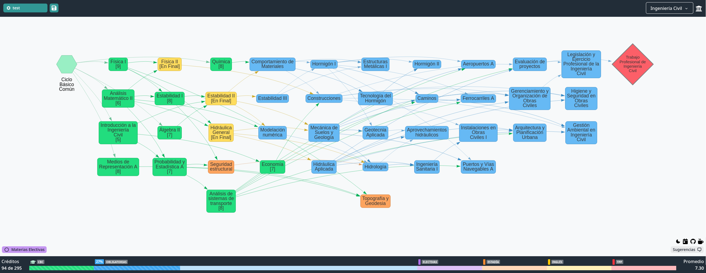

# [FIUBA Map](https://fede.dm/FIUBA-Map/)

Mapa de materias y sus correlativas de la Facultad de Ingeniería

---

La idea de este proyecto es presentar de una manera interactiva el plan de estudios de las carreras de la Facultad de Ingeniería, Universidad de Buenos Aires, para saber que materias se pueden cursar, cuantos créditos se tienen actualmente y demás.

<a href='https://imgur.com/QkXbwFc'></a>

- Tiene todas las carreras que se dan en la Facultad de Ingeniería, en sus respectivos últimos planes de estudio.

- Todas las carreras incluyen todas las materias electivas y todas las materias de sus respectivas orientaciones.

- Trackea la cantidad de créditos que se tienen en la carrera, incluyendo si se quiere terminar con tésis/tpp, y que orientación se elige

- Base de datos! Se pueden marcar todas las materias apobradas y guardarlas bajo un padrón (o cualquier clave).

- Poner materias en final! Para no olvidarse los finales colgados.

---

## Desarrollo

La base de datos del FIUBA-Map es solamente una lista de registros almacenados en [jsonbin.io](https://jsonbin.io/). Para poder interactuar con estos datos hace falta tener un mínimo servidor que haga de pasamanos entre el FIUBA-Map y jsonbin. Localmente no se va a poder acceder a la base de datos a menos que se tenga el archivo `.env` con las credenciales correspondientes.

```sh
npm install # dependencias
npm start # levanta el servidor de desarrollo en localhost:3001 y el cliente en localhost:3000
```
