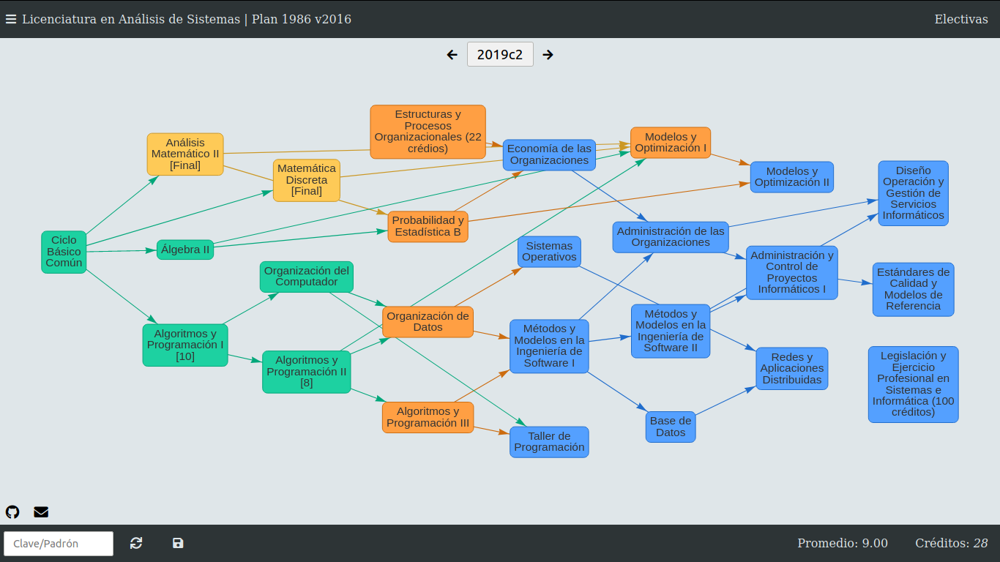

# [FIUBA Map](https://fdelmazo.github.io/FIUBA-Map/)

Mapa de materias y sus correlativas de la Facultad de Ingeniería

---

La idea de este proyecto es presentar de una manera interactiva y visualmente rica en información el plan de estudios de las carreras de la Facultad de Ingeniería, Universidad de Buenos Aires, para saber que materias se pueden cursar, cuantos créditos se tienen actualmente y demás.

- Tiene todas las carreras que se dan en la Facultad de Ingeniería, en sus respectivos últimos planes de estudio.

- Todas las carreras incluyen todas las materias electivas y todas las materias de sus respectivas orientaciones.

- Trackea la cantidad de créditos que se tienen en la carrera, incluyendo si se quiere terminar con tésis/tpp, y que orientación se elige

- Base de datos! Se pueden marcar todas las materias apobradas y guardarlas bajo un padrón (o cualquier clave).

- Poner materias en final! Para no olvidarse los finales colgados.

---

Esta aplicación está hecha en React y todo su código fuente está en `src`. Para el front usa [Chakra](https://chakra-ui.com/). El sitio compilado en sí está en el directorio `docs`, y esto es lo que se sirve con github pages.

## Desarrollo

Para agregar un feature o fixear un issue hay que clonar el repositorio, instalar las dependencias con `npm install` y después correr la aplicación con `npm start`. En `localhost:3000/` va a estar corriendo la aplicación constantemente, y toda modificación que se haga al código se va a ver reflejada en la página.

Una vez terminados los cambios, con solo hacer un PR basta (porque la aplicación se compila automáticamente con cada push a master).

Hay que tener en cuenta que localmente no funciona la base de datos, para evitar que se le pueda pegar desde cualquier lado. Si se necesita arreglar algo que interactua con la db, pedirle a algun autor la API key correspondiente.
